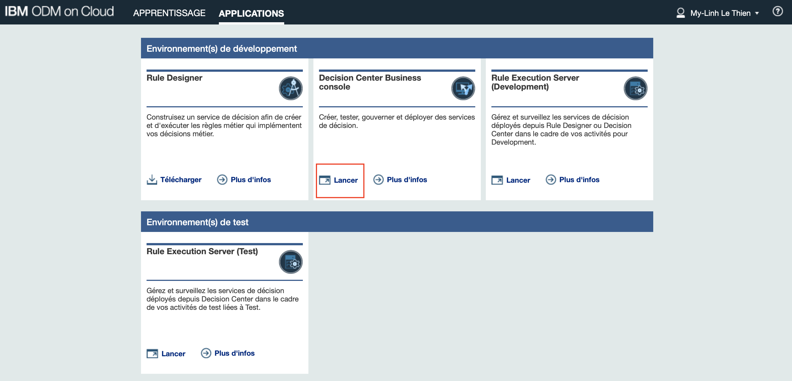
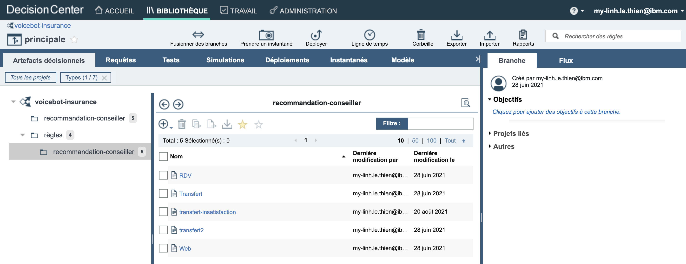

# IBM Augmented Call Center - Insurance

This project is an augmented call center in insurance using an interface which displays the conversation with IBM Watson in real time, using IBM Event Streams, IBM Cloudant database, IBM Language Translator, IBM Natural Language Understanding and Operational Decision Manager.    
You can check the live demo:
  
The initial project was implemented in French language but it can be used in other languages available on IBM Cloud.  

Watson automatically detects the intents of the client and qualifies their demand. According to the client's profile, their emotion and reason for call, the voicebot will adapt the answer: call transfer, SMS sending or planning a meeting.

Here is the simplified architecture of the demo:

---
# Requirements

First, we need to provision all the service instances for this demo.

1. Sign up for an [IBM Cloud account](https://cloud.ibm.com/registration).
2. Sign up for a [Twilio](https://www.twilio.com/) account.

###   Twilio Trial account
On your **Twilio** account, you need to provide a phone number in order to be able to call your virtual Voice Agent.
- Go to your [phone numbers](https://www.twilio.com/console/phone-numbers/incoming) on your Twilio account and provide a phone number.

###  Watson assistant dialog 
You need to provision a **Watson Assistant** service instance on IBM Cloud.
 
- Go to [Watson Assistant](https://cloud.ibm.com/catalog/services/watson-assistant) and create an instance of the service.

To create your dialog and assistant, you can download the [Watson Assistant skill](docs/voice-agent-assurance-twilio-v2-dialog.json) and import it as a skill in the Watson Assistant interface in IBM Cloud.

You should then be able to access the dialog nodes, the intents and entities.

You can test the dialog and scenarios by following [demo.txt document](docs/demo.txt).

Now you can navigate to the tab "Assistants" and create an assistant using the skill you just imported.

On the right-hand side on the screen, you should normally see a section to **add integration**.
That is where you can add your Twilio phone integration and SMS with Twilio.

- Choose the phone integration option
- Name your integration and click on **Create**
- Click on **Use an existing phone number with an external provider** then **Next**
- Then copy the SIP URI provided.
- Navigate to your Twilio account in the tab **Elastic SIP Trunks**

- In the **Manage** tab, then **Trunks** you are able to **create a new SIP Trunk**.

- Give it a friendly name
- Then in the **General** tab, you are able to configure the parameters for your voice agent. You can allow **Call transfer**.

- In the **Origination** tab, you can add an **Origination URI** and this is where you can configure the SIP URI you just copied from Watson Assistant Phone Integration.
- Make sure your Twilio Phone number point to the SIP trunk you just created.

- You can now re-open IBM Cloud Watson Assistant tab, and continue the Phone integration configuration by clicking on **Next**
- Set up your Twilio phone number
- Set up a Speech To Text instance
- Set up a Text to Speech
- Test your agent: Call the phone number that you configured to speak to your voice agent. If you hear a response, your voice agent is active.

For more information about Watson Assistant phone integration, refer to [IBM Cloud's documentation](https://cloud.ibm.com/docs/assistant?topic=assistant-deploy-phone).

- For the "SMS with Twilio" integration, click on **add integration**
- Scroll down to choose "SMS with Twilio"
- Then, you'll be asked to refer you Twilio Account SID. You will find it on your Twilio account page.
- Same as the auth token.
- Set up your Twilio phone number.
- Copy and paste the webhook URI in Twilio. For your phone number, when a "message comes in"

###  Cloudant database
You will need to create a **Cloudant** database on IBM Cloud:
- Go to the [Cloudant](https://cloud.ibm.com/catalog/services/cloudant) page in the IBM Cloud Catalog.
- Log in to your IBM Cloud account.
- Choose IAM and legacy credentials as Authentification method
- Click on **Create**.

In this instance, you need to create a first database called **base-client** and add the document [base-client.json](docs/base-client.json), which corresponds to a first client profile. You can add as many client profiles as you want in your database. In this example, we added three different client profiles. 

   

Then, you will create a second database called **odm-answer** and add the document [odm-answer-doc.json](docs/odm-answer-doc.json). This document will be updated according to ODM's recommendation throughout the conversation.

###  Event Streams
You will need to create an **Event Streams** instance on IBM Cloud:
- Go to the [Event Streams](https://cloud.ibm.com/catalog/services/event-streams) page in the IBM Cloud Catalog.
- Log in to your IBM Cloud account.
- Click on **Create**.
- Once your Event Streams instance is created, click on **Topics** tab.
- Create a topic named **watson-messages**. 

This will be useful to generate real-time messages on the user interface.

###  IBM Cloud Functions
We will implement 3 different cloud functions for our demo.
1. one action function to retrieve information from our Cloudant document (the ODM answer)

- Open [IBM Cloud Functions](https://cloud.ibm.com/functions/)
- Create a Node.js action function
- Copy the code from the file [cloudFunctions.js](docs/cloudantFunction.js)
- Paste it in your action function you just created
- Insert your Cloudant URL and document id, and credentials
- Click on Save and Invoke the action to see if the code works well
- You should be able to see the content of the Cloudant document

- In the **Endpoints** tab, Click on **Enable as Web Action**
- Save and copy the URL created

- Open Watson Assistant dashboard and skill you imported
- Navigate to **Webhooks** tab, and paste the URL of your Web action

I advise you to try your Assistant dialog with the **Try** button at the top right-hand corner of your screen.
You can follow the dialog here [demo.txt document](docs/demo.txt). If you manage to finish the dialog, your webhook works well.

For the two following action functions, we will use kafka python package to produce real-time messages.

2. one action function using Event Streams to produce messages

- Open [IBM Cloud Functions](https://cloud.ibm.com/functions/)
- Create a Python action function
- Copy the python code from [produceFunction.py file](docs/produceFunction.py)
- Paste it in your action function you just created
- Set up your Event streams credentials (password and brokers list)
- Click on Save button
- Navigate to the **Endpoints** tab.
- Enable as Web action and copy the URL
- Go to Watson Assistant, in the **Assistants** tab
- Click on **Settings**

- Go to the **Webhooks** tab and paste this URL in **Pre-message webhook** and **Post-message webhook** (don't forget to enable them)
- add a secret of your choice
- Add header name "Content-Type" and header value "application/json"

3. one action function using Event Streams to end the conversation

This function will be called after each conversation when the user hangs up.
- Open [IBM Cloud Functions](https://cloud.ibm.com/functions/)
- Create a Python action function
- Copy the Python code from [produceEndMessage.py file](docs/produceEndMessage.py)
- Paste it in your action function you just created
- Set up your Event streams credentials (password and brokers list)
- Click on Save button
- Navigate to the **Endpoints** tab.
- Enable as Web action and copy the URL
- Go to Watson Assistant, in the **Assistants** tab
- Click on **Settings**

- In IBM Cloud Function, open the function you just created named **produceEndMessage** and navigate to the **Endpoints** tab.
- Enable as Web action and copy the URL
- Go to Watson Assistant, in the **Assistants** tab
- Click on **Settings**

- Go to the **Webhooks** tab and paste this URL in **Log webhook** (don't forget to enable it)
- add a secret of your choice
- Add header name "Content-Type" and header value "application/json"
- Enable **Subscribe to CDR**

###  ODM (Operational Decision Manager)

You need to create an **ODM** account.
- Go to the [ODM](https://www.bpm.ibmcloud.com/auth/index.jsp) page.
- Create an account of IBM ODM on Cloud.
- Once you have an account, navigate to **Decision Center Business Console** and Launch it.

- Download ZIP file [voicebot-insurance.zip](docs/voicebot-insurance.zip)
- In the Decision Center, **import a decision service** and submit the ZIP file you just downloaded

- You should be able to see the list of rules

- Click on **Deploy** in the menu
- Deploy this Decision service as a RuleApp. You will be asked to download the RuleApp archive.
- Navigate to **Rule Execution Server (test)**

- In the Explorator, click on **deploy a RuleApp archive**

- You will need to deploy the resource [voicebot-xom.zip](docs/voicebot-xom.zip) and create a library linked to this resource

- You will then be able to test your REST ODM service.

You can follow this tutorial video for more details on how to deploy and test your rules.
  

For more information about ODM on Cloud, refer to the [documentation](https://www.ibm.com/docs/en/odmoc?topic=ruleapps-deploying-ruleapp-archives).

###  Language Translator

You need to create a **Language Translator** instance on IBM Cloud:
- Go to the [Language Translator](https://cloud.ibm.com/catalog/services/language-translator) page in the IBM Cloud Catalog.
- Log in to your IBM Cloud account.
- Click on **Create**.

###  Natural Language Understanding

You need to create a **Natural Language Understanding** instance on IBM Cloud:
- Go to the [Natural Language Understanding](https://cloud.ibm.com/catalog/services/natural-language-understanding) page in the IBM Cloud Catalog.
- Log in to your IBM Cloud account.
- Click on **Create**.

You can now test your virtual agent by calling your Twilio phone number and see if the conversation goes well on the phone. 

---
# Installation and deployment of the project

There are two existing applications:
- a React frontend application which will display the conversation, the client profile, the sentiment analysis and the ODM recommandation in real time.
- a backend application which analyzes each message from the conversation. This application contains all the connections to the services (IBM Event Streams, Cloudant database, Language Translator, Natural Language Understanding and ODM).
The two applications are linked and interact via [Socket.io](https://socket.io).
   

This is the user interface for the demo.

The frontend application (here called React-socket) is available on [https://github.com/mylinhlethien/react-socket-demo](https://github.com/mylinhlethien/react-socket-demo)  
The backend application (called voiceagent-api) is available on [https://github.com/mylinhlethien/voiceagent-api-demo](https://github.com/mylinhlethien/voiceagent-api-demo)

You can choose to run the applications locally or deploy them on a Kubernetes cluster. Refer to these two applications.

<!-- CONTACT -->
## Contact

My-Linh Le Thien - [@mylinhlethien](https://www.linkedin.com/in/mylinhlethien/)

Project Link: [https://github.com/mylinhlethien/crm-webapp-demo](https://github.com/mylinhlethien/crm-webapp-demo)

